# Database Entity Relationship Diagram (ERD)
## Rental Zone Admin Backend - Complete Database Schema

This document contains the complete database architecture with 47 collections and their relationships.

---

## 🗺️ Interactive Database Diagram

```mermaid
erDiagram
    %% ========================================
    %% CORE LOCATION HIERARCHY
    %% ========================================
    
    Country ||--o{ State : "has many"
    State ||--o{ City : "has many"
    City ||--o{ Area : "has many"
    
    Country {
        ObjectId _id PK
        String name
        Number sorting
        Number unique_id UK
        Date createdAt
        Date updatedAt
    }
    
    State {
        ObjectId _id PK
        Number country_id FK
        String name
        Number sorting
        Number unique_id UK
        Date createdAt
        Date updatedAt
    }
    
    City {
        ObjectId _id PK
        Number state_id FK
        String name
        Number sorting
        Boolean is_popular
        Number unique_id UK
        Date createdAt
        Date updatedAt
    }
    
    Area {
        ObjectId _id PK
        Number city_id FK
        String name
        Number sorting
        Number unique_id UK
        Date createdAt
        Date updatedAt
    }
    
    %% ========================================
    %% USER MANAGEMENT
    %% ========================================
    
    User ||--o{ Listings : "creates"
    User ||--o{ ListingReview : "writes"
    User ||--o{ BlogReview : "writes"
    User ||--o{ UserActivity : "has"
    User ||--o{ UserActionActivity : "performs"
    User }o--|| Country : "belongs to"
    User }o--|| State : "belongs to"
    User }o--|| City : "belongs to"
    User }o--|| Area : "belongs to"
    
    User {
        ObjectId _id PK
        String name
        String password
        String email UK
        String role
        String phone_number
        String profile_pic
        String profile_banner
        String website
        String show_website
        String is_approved
        String is_verified
        String is_blocked
        String sub_role
        String company_name
        Number country_id FK
        Number state_id FK
        Number city_id FK
        Number area_id FK
        String pincode
        Date last_login
        Boolean status
        Date createdAt
        Date updatedAt
    }
    
    UsersOtp {
        ObjectId _id PK
        String identifier
        String otp
        String email
        String device_info
        String status
        Date createdAt
        Date updatedAt
    }
    
    UserActivity {
        ObjectId _id PK
        ObjectId user_id FK
        String ip_address
        String device
        String browser
        String os
        String country
        String city
        String region
        String timezone
        Date createdAt
        Date updatedAt
    }
    
    UserActionActivity {
        ObjectId _id PK
        ObjectId user_id FK
        String description
        String action_type
        String model
        Boolean is_active
        Date createdAt
        Date updatedAt
    }
    
    %% ========================================
    %% LISTING SYSTEM (CORE)
    %% ========================================
    
    Listings }o--|| User : "owned by"
    Listings }o--|| Country : "located in"
    Listings }o--|| State : "located in"
    Listings }o--|{ City : "serves"
    Listings }o--|| Area : "located in"
    Listings }o--|{ Category : "belongs to"
    Listings ||--o{ ListingReview : "has"
    Listings ||--o{ Products : "contains"
    Listings ||--o| Listingseo : "has SEO"
    Listings ||--o| FeaturedListing : "can be featured"
    Listings ||--o| PremiumListing : "can be premium"
    Listings }o--|{ MarketingBanner : "appears in"
    Listings }o--|{ NewsLetter : "featured in"
    
    Listings {
        ObjectId _id PK
        ObjectId user_id FK
        String listing_unique_id UK
        Array category_ids
        String listing_image
        String name
        String slug
        String address
        String pincode
        String latitude
        String longitude
        Number country_id FK
        Number state_id FK
        Array city_ids
        Number area_id FK
        Boolean is_area_all_selected
        Boolean is_city_all_selected
        String phone_number
        String email
        String second_phone_no
        String second_email
        String website
        String listing_type
        String price
        String time_duration
        String cover_image
        String mobile_cover_image
        String description
        String contact_person
        Boolean approved
        Boolean is_top_listing
        Number listing_avg_rating
        Number listing_reviews_count
        Number views_count
        Date createdAt
        Date updatedAt
    }
    
    ListingReview {
        ObjectId _id PK
        ObjectId listing_id FK
        ObjectId user_id FK
        Number rating
        String review
        Boolean approved
        Date createdAt
        Date updatedAt
    }
    
    Listingseo {
        ObjectId _id PK
        String listing_id FK
        String page_title
        String meta_description
        String canonical
        String meta_keywords
        Date createdAt
        Date updatedAt
    }
    
    FeaturedListing {
        ObjectId _id PK
        Array category_ids
        Array city_ids
        String listing_id UK
        Boolean premium
        Boolean is_featured_on_homepage
        Number sorting
        Date createdAt
        Date updatedAt
    }
    
    PremiumListing {
        ObjectId _id PK
        String listing_id FK
        Array city_ids
        String package_name
        Date start_date
        Date end_date
        Boolean status
        Date createdAt
        Date updatedAt
    }
    
    %% ========================================
    %% CATEGORY SYSTEM
    %% ========================================
    
    Category ||--o{ Listings : "categorizes"
    Category ||--o{ Products : "categorizes"
    Category ||--o| Categoryseo : "has SEO"
    Category ||--o| SubdomainCategoryseo : "has subdomain SEO"
    Category ||--o{ CategorySearch : "tracked in"
    Category }o--|{ Banners : "displayed in"
    Category }o--|{ ChatBoatUser : "used by chatbot"
    Category }o--|{ Quotation : "requested in"
    
    Category {
        ObjectId _id PK
        String name
        String slug
        String subdomain_slug
        String desktop_image
        String mobile_image
        String description
        String subdomain_description
        String page_top_keyword
        String page_top_descritpion
        Number sorting
        Number unique_id UK
        Boolean status
        Number ratingvalue
        Number ratingcount
        Array related_categories
        Date createdAt
        Date updatedAt
    }
    
    Categoryseo {
        ObjectId _id PK
        Number category_id FK
        Number city_id
        String page_title
        String meta_description
        String meta_keywords
        String canonical
        String schema_type
        String og_title
        String og_description
        String og_image
        String twitter_title
        String twitter_description
        String twitter_image
        Date createdAt
        Date updatedAt
    }
    
    SubdomainCategoryseo {
        ObjectId _id PK
        Number category_id FK
        Number city_id
        String page_title
        String meta_description
        String meta_keywords
        String canonical
        String schema_type
        String og_title
        String og_description
        String og_image
        String twitter_title
        String twitter_description
        String twitter_image
        Date createdAt
        Date updatedAt
    }
    
    CategorySearch {
        ObjectId _id PK
        ObjectId category_id FK
        Date search_date
        Date createdAt
        Date updatedAt
    }
    
    %% ========================================
    %% PRODUCT SYSTEM
    %% ========================================
    
    Products }o--|| Listings : "belongs to"
    Products }o--|| Category : "categorized as"
    
    Products {
        ObjectId _id PK
        Number unique_id UK
        String name
        Array product_images
        String description
        String specifications
        String listing_id FK
        Number category_id FK
        Boolean status
        Number ratingvalue
        Number ratingcount
        Date createdAt
        Date updatedAt
    }
    
    %% ========================================
    %% BLOG SYSTEM
    %% ========================================
    
    BlogCategory ||--o{ Blog : "contains"
    Blog ||--o{ BlogReview : "has"
    BlogReview }o--|| User : "written by"
    
    BlogCategory {
        ObjectId _id PK
        String name
        String slug
        Date createdAt
        Date updatedAt
    }
    
    Blog {
        ObjectId _id PK
        Array blog_category_id
        String title
        String slug UK
        String blog_image
        String author
        String description
        Number status
        String meta_description
        Date createdAt
        Date updatedAt
    }
    
    BlogReview {
        ObjectId _id PK
        ObjectId blog_id FK
        ObjectId user_id FK
        Number rating
        String review
        Boolean approved
        Date createdAt
        Date updatedAt
    }
    
    %% ========================================
    %% BANNER & MARKETING
    %% ========================================
    
    BannerTypes ||--o{ Banners : "defines"
    Banners }o--|| Country : "targets"
    Banners }o--|| State : "targets"
    Banners }o--|{ City : "targets"
    Banners }o--|{ Category : "displays for"
    
    BannerTypes {
        ObjectId _id PK
        String banner_type
        String banner_width
        String banner_height
        String banner_position
        String banner_description
        String banner_page
        Date createdAt
        Date updatedAt
    }
    
    Banners {
        ObjectId _id PK
        ObjectId banner_type_id FK
        Array category_ids
        Boolean is_category_all_selected
        Number country_id FK
        Number state_id FK
        Array city_ids
        Boolean is_city_all_selected
        String banner_name
        String banner_image
        String banner_link
        Number banner_sorting
        String banner_target
        Array exclude_city_ids
        Date createdAt
        Date updatedAt
    }
    
    BannersTheme {
        ObjectId _id PK
        String name
        String banner_image
        String banner_image_link
        Boolean status
        Array exclude_routes
        Date createdAt
        Date updatedAt
    }
    
    MarketingBanner {
        ObjectId _id PK
        String banner_name
        String banner_image
        Array listing_ids
        Date createdAt
        Date updatedAt
    }
    
    %% ========================================
    %% JOB SYSTEM
    %% ========================================
    
    JobCategory ||--o{ Jobs : "categorizes"
    Jobs ||--o{ JobApplication : "receives"
    
    JobCategory {
        ObjectId _id PK
        String name
        String slug
        String image
        Number sorting
        Number unique_id UK
        Boolean status
        Date createdAt
        Date updatedAt
    }
    
    Jobs {
        ObjectId _id PK
        Number unique_id UK
        Array job_category_id
        String title
        String slug
        String location
        String experience
        String salary
        Array skills
        String job_type
        String description
        String company_name
        String company_logo
        Date createdAt
        Date updatedAt
    }
    
    JobApplication {
        ObjectId _id PK
        Array job_ids
        String name
        String email
        Date createdAt
        Date updatedAt
    }
    
    Counter {
        ObjectId _id PK
        String model UK
        Number count
    }
    
    %% ========================================
    %% SETTINGS & CONFIGURATION
    %% ========================================
    
    Theme ||--o{ Setting : "applied to"
    
    Theme {
        ObjectId _id PK
        String theme_name
        String box_shadow
        String footer_background
        String button_shadow
        String body_background
        Date createdAt
        Date updatedAt
    }
    
    Setting {
        ObjectId _id PK
        String super_admin
        String email_for_otp
        String contact_email
        String quotation_emails
        String phone_number
        String website_logo
        String mobile_logo
        String fav_icon
        String pre_loader
        String mobile_listing_banner
        String desktop_listing_banner
        String login_page_content
        String category_box_links
        String sidebar_button_sequence
        String facebook
        String twitter
        String linkedin
        String quotation_number
        String whatsapp_key
        String send_whatsapp_message
        String send_mail_to_premium_listing
        String home_page_layout_style
        String send_quotation_mail
        ObjectId theme_id FK
        String footer_description
        Date createdAt
        Date updatedAt
    }
    
    %% ========================================
    %% MISCELLANEOUS
    %% ========================================
    
    Quotation {
        ObjectId _id PK
        Array categories
        String user_type
        String company_name
        Number quantity
        String email
        String phone
        String rental_city
        String rental_duration
        String status
        String send_quotation_mail
        String message
        Date createdAt
        Date updatedAt
    }
    
    ContactUs {
        ObjectId _id PK
        String name
        String email
        String message
        Date createdAt
        Date updatedAt
    }
    
    FAQ {
        ObjectId _id PK
        String question
        String answer
        Date createdAt
        Date updatedAt
    }
    
    StaticPage {
        ObjectId _id PK
        String page_name
        String page_content
        Date createdAt
        Date updatedAt
    }
    
    RedirectsUrl {
        ObjectId _id PK
        String from_url
        String to_url
        Date createdAt
        Date updatedAt
    }
    
    Keyword {
        ObjectId _id PK
        String keyword
        Date createdAt
        Date updatedAt
    }
    
    Homepage_seo {
        ObjectId _id PK
        String page_title
        String meta_description
        String meta_keywords
        String canonical
        Date createdAt
        Date updatedAt
    }
    
    IpAddress {
        ObjectId _id PK
        String ip_address
        String country
        String city
        String status
        Date createdAt
        Date updatedAt
    }
    
    IpBlacklist {
        ObjectId _id PK
        String ip_address UK
        String status
        String reason
        String notes
        Date banned_at
        Date createdAt
        Date updatedAt
    }
    
    NewsLetter {
        ObjectId _id PK
        String from_email
        String subject
        Array listing_ids
        Date createdAt
        Date updatedAt
    }
    
    Subscribers {
        ObjectId _id PK
        String name
        String email
        Boolean active
        Date createdAt
        Date updatedAt
    }
    
    PremiumRequest {
        ObjectId _id PK
        String name
        String email
        String phone
        String listing_id
        String message
        Date createdAt
        Date updatedAt
    }
    
    ChatboatListing {
        ObjectId _id PK
        Number city_id FK
        Boolean status
        Array listings
        Date createdAt
        Date updatedAt
    }
    
    ChatBoatUser {
        ObjectId _id PK
        Array category_ids
        String user_name
        String greeting_message
        Date createdAt
        Date updatedAt
    }
    
    ExportTask {
        ObjectId _id PK
        String file_path
        String status
        Date started_at
        Date completed_at
        Date createdAt
        Date updatedAt
    }
    
    import_file_status {
        ObjectId _id PK
        String file_path
        Date createdAt
        Date updatedAt
    }
```



---

## 📊 Database Statistics

- **Total Collections**: 47
- **Core Entities**: User, Listings, Category, Products
- **Location Hierarchy**: Country → State → City → Area
- **Review Systems**: Listings, Blog, Products
- **Marketing**: Banners, Featured Listings, Premium Listings
- **Content Management**: Blog, Static Pages, FAQ
- **Job Board**: JobCategory, Jobs, JobApplication

---

## 🔗 Key Relationships Summary

### **1. Location Hierarchy (4 levels)**
```
Country (1) → (N) State (1) → (N) City (1) → (N) Area
```

### **2. User Ecosystem**
- User creates multiple Listings
- User writes Reviews (Listings & Blogs)
- User has Activity tracking (UserActivity, UserActionActivity)
- User belongs to Location (Country/State/City/Area)

### **3. Listing Ecosystem** (Core Business Logic)
- Listings → owned by User
- Listings → categorized by Categories
- Listings → located in Geography (Country/State/City/Area)
- Listings → contains Products
- Listings → has Reviews
- Listings → has SEO metadata
- Listings → can be Featured or Premium
- Listings → appears in Marketing Banners

### **4. Category System**
- Categories → organize Listings & Products
- Categories → have SEO metadata (regular & subdomain)
- Categories → tracked in searches
- Categories → displayed in Banners

### **5. Content Management**
- Blog → categorized by BlogCategory
- Blog → has BlogReviews
- Static Pages, FAQ, Keywords

### **6. Marketing & Monetization**
- Banners (types, targeting by location/category)
- Featured Listings (homepage display)
- Premium Listings (paid promotion)
- Marketing Banners (promotional campaigns)

### **7. Job Board**
- JobCategory → contains Jobs
- Jobs → receive JobApplications

### **8. Configuration**
- Settings → use Theme
- Multiple configuration tables (Redirects, IP management, etc.)

---

## 📈 Entity Importance Ranking

### **Critical (Core Business)**
1. **User** - All authenticated operations
2. **Listings** - Main inventory/content
3. **Category** - Organization structure
4. **City/State/Country/Area** - Geographic targeting

### **High Priority**
5. **Products** - Listing details
6. **ListingReview** - Social proof
7. **FeaturedListing** - Visibility
8. **PremiumListing** - Revenue
9. **Banners** - Marketing

### **Medium Priority**
10. **Blog** - Content marketing
11. **Jobs** - Additional service
12. **Setting** - Configuration
13. **Quotation** - Lead generation

### **Supporting**
- SEO tables (Categoryseo, Listingseo, etc.)
- Activity tracking (UserActivity, CategorySearch)
- Communication (NewsLetter, ContactUs)
- Security (IpBlacklist, IpAddress)

---

## 🎯 Common Query Patterns

### **Listing Discovery**
```
User → Select Location (City/Area)
  → Select Category
    → View Listings (filtered, sorted)
      → View Products
        → Read Reviews
```

### **User Journey**
```
Anonymous → Browse Listings
  → Register/Login
    → Create Listing
      → Add Products
        → Promote (Featured/Premium)
```

### **Admin Operations**
```
Admin → Manage Categories
  → Configure Banners
    → Approve Listings
      → Manage Users
        → View Analytics
```

---

## 💡 Design Patterns Observed

1. **Soft Location References**: Most models use Number IDs for location (not ObjectId)
2. **Flexible Category System**: Array of category IDs for multi-categorization
3. **Dual SEO Tables**: Separate SEO for regular & subdomain routes
4. **Activity Tracking**: Comprehensive user action logging
5. **Marketing Flexibility**: Multiple promotion mechanisms (Featured, Premium, Banners)
6. **Multi-tenant Ready**: User-owned listings with approval workflow

---

## 🔐 Security & Access Control

- **User Roles**: role, sub_role fields
- **Approval Workflow**: approved flags on User, Listings, Reviews
- **IP Management**: IpAddress, IpBlacklist for security
- **Status Flags**: is_blocked, is_verified, is_approved
- **Activity Logging**: UserActivity, UserActionActivity for audit trail

---

## 📝 Notes

- Auto-increment fields use Counter collection or schema pre-hooks
- Most models have timestamps (createdAt, updatedAt)
- Slugs are auto-generated for URL-friendly routing
- Ratings use 1-5 scale with count tracking
- Geographic data supports multi-level targeting

---

**Generated**: November 14, 2025  
**Database**: MongoDB (Mongoose ODM)  
**Total Collections**: 47  
**Diagram Format**: Mermaid ERD
